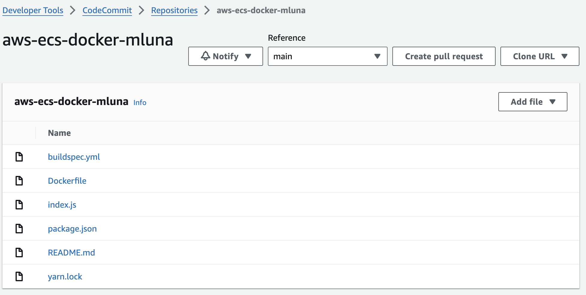
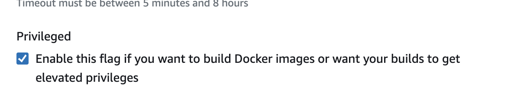

# LABORATORIO DE CI/CD PIPELINE using CodePipeline, CodeCommit, CodeBuild, CodeDeploy to ECS ECR 🚀


## CODECOMMIT STARTER CONFIG
1. Para autenticarnos con los repositorios de CodeCommit tenemos 2 opciones.
- Genero HTTPS git credentials para AWS CodeCommit, esto en la consola del usuario donde se obtienes los keys.
    
    1. Editamos el archivo ~/.gitconfig
    ```bash
    [credential]
    helper = store
    ```
    2. Almacenar tus credenciales.
    Guarda tus credenciales HTTPS Git de CodeCommit en un archivo de texto en tu directorio home:

        ```bash
        touch ~/.git-credentials
        ```
    Y anade el archivo tus credenciales con el siguiente formato.
    ```bash
    https://<username>:<password>@git-codecommit.<region>.amazonaws.com
    ```
- Configurar Git para usar el AWS CLI Credential Helper. 
Esto configura Git para usar las credenciales de IAM almacenadas en AWS CLI para autenticarse con CodeCommit.
    ```bash
    git config --global credential.helper '!aws codecommit credential-helper $@'
    git config --global credential.UseHttpPath true
    ```
Si usamos AWS profiles.
```bash
git config credential.helper '!aws --profile tu-perfil codecommit credential-helper $@'

```
2. Creamos un repositorio en CodeCommit, copiamos la URL para clonarlo en el local. Ingresamos a la carpeta clonada y agregamos los archivos de Docker, hacemos commit, push y tenemos el repo actualizado.




## ECR STARTER CONFIG
1. Creamos un ECR, obtenemos la URI y lo actualizamos en el buildspec.yml.

## CODEBUILD STARTER CONFIG
1. Creamos un proyecto de Codebuild, escogemos como source Codecommit y la rama main que ya actualizamos e incluye el archivo **buildspec.yml**.
OJO: No olvidemos habilitar el flag de privilegios elevados.
